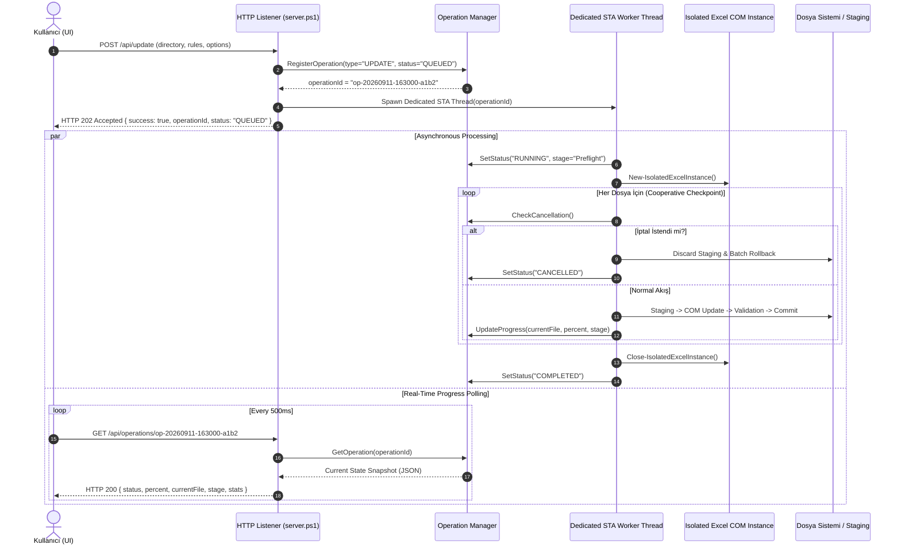

# EXCEL SQL CONNECT PRO — PHASE 3 IMPLEMENTATION PLAN
**Operasyonel Mükemmellik, Arka Plan STA Worker, Canlı İlerleme, Önizleme (Dry Run) ve Güvenli İptal Mimarisi**

---

## A. Existing Architecture (Mevcut Durum Analizi)

### 1. HTTP İstek Yaşam Döngüsü ve Thread Bloklanması
- `server.ps1` dosyasındaki HTTP dinleyicisi tek bir ana iş parçacığı üzerinde çalışmaktadır (`while ($listener.IsListening) { $context = $listener.GetContext() ... }`).
- Kullanıcı arayüzünden `POST /api/update` isteği geldiğinde, `Update-ExcelDirectory` fonksiyonu doğrudan bu HTTP dinleme iş parçacığı içerisinde senkron olarak çağrılmaktadır.
- **Kritik Sorun:** Bir klasördeki 10–50 Excel dosyasının taranması veya güncellenmesi 30 saniye ile birkaç dakika arasında sürebilmektedir. Bu süre zarfında:
  1. HTTP bağlantısı dakikalarca açık kalmakta ve zaman aşımı (HTTP timeout) riski oluşmaktadır.
  2. Sunucu bu süre zarfında gelen başka hiçbir HTTP isteğini (örneğin `/api/progress` sorgusu, `/api/list-folders`, statik dosya istekleri) işleyememekte; tarayıcının arayüzü ve ilerleme çubuğu yanıt alamadığı için kilitlenmektedir.
  3. `$global:ProgressState` global bir değişken olarak tutulmakta, işlem bitince sıfırlanmakta ve geçmişe dönük hiçbir iz bırakmamaktadır.

### 2. İptal ve Duraklatma Desteğinin Bulunmaması
- Kullanıcı güncellemeyi başlattıktan sonra işlemi iptal edememektedir. Tarayıcı sekmesi kapatılsa bile backend'deki PowerShell süreci arka planda dosya güncellemelerine körlemesine devam etmektedir.

### 3. Loglama ve İzsürülebilirlik Eksikliği
- Loglar sadece frontend arayüzündeki DOM log konsoluna yazılmakta; sunucu kapandığında veya sayfa yenilendiğinde tüm geçmiş kaybolmaktadır. Disk üzerinde yapılandırılmış (JSONL/Audit) hiçbir kalıcı operasyon günlüğü bulunmamaktadır.

### 4. Önizleme (Dry Run) Eksikliği
- Kullanıcı "Toplu Güncellemeyi Başlat" butonuna bastığında, tarayıcının ilkel `confirm()` penceresi haricinde hangi dosyada kaç değişiklik yapılacağını, hangi formüllerin etkileneceğini gösteren güvenli bir simülasyon/önizleme adımı bulunmamaktadır.

---

## B. Proposed Background Worker Architecture (Önerilen Arka Plan STA Worker Mimarisi)



### 1. STA (Single-Threaded Apartment) Gereksinimi
- Excel COM otomasyonu katı bir şekilde **STA** thread modeline bağımlıdır. Çoklu iş parçacıklı varsayılan MTA (Multi-Threaded Apartment) havuzları `RPC_E_WRONG_THREAD` hatalarına veya kilitlenmelere yol açar.
- **Çözüm:** Arka plan operasyonları için `[System.Threading.Thread]` nesnesi oluşturulacak, açıkça `SetApartmentState([System.Threading.ApartmentState]::STA)` atanacak ve iş parçacığı bu tecrit edilmiş STA dairesinde çalıştırılacaktır.
- HTTP listener iş parçacığı ile STA worker iş parçacığı arasındaki veri aktarımı thread-safe senkronizasyon nesneleri (`ConcurrentDictionary[string, hashtable]` ve kilit nesneleri) üzerinden yapılacaktır.

### 2. Tek Aktif Güncelleme Kuralı (Single Active Mutex)
- Aynı anda birden fazla Excel COM güncelleme operasyonunun çalıştırılması dosya kilit çakışmalarına ve Excel COM çökmesine sebep olabileceğinden; sistemde aynı anda **yalnızca 1 adet `RUNNING` update operasyonuna** izin verilecektir.
- Yeni bir güncelleme talebi geldiğinde aktif bir operasyon varsa sunucu derhal **HTTP 409 Conflict** (`OPERATION_ALREADY_RUNNING`) dönecektir.
- Önizleme ve Tarama işlemleri de bu operasyon kuralına uygun şekilde yönetilecektir.

---

## C. Operation State Model (Yapılandırılmış Durum Modeli)

Tüm operasyonlar (`SCAN`, `PREVIEW`, `UPDATE`, `RESTORE`) merkezi bir state şemasına sahip olacaktır:

```json
{
  "operationId": "op-20260911-163000-a1b2",
  "type": "UPDATE",
  "status": "RUNNING",
  "createdAt": "2026-09-11T13:30:00.000Z",
  "startedAt": "2026-09-11T13:30:00.050Z",
  "finishedAt": null,
  "directory": "C:\\Sirket\\Mali_Raporlar",
  "totalFiles": 12,
  "processedFiles": 5,
  "updatedFiles": 4,
  "skippedFiles": 1,
  "failedFiles": 0,
  "currentFile": "PLAN v4.2.xlsm",
  "currentStage": "Excel Update",
  "progressPercent": 42,
  "warnings": [],
  "errors": [],
  "backupDirectory": "C:\\Sirket\\Mali_Raporlar\\_ExcelUpdater_Backups\\backup_20260911_163000",
  "batchStatus": "PENDING",
  "cancelRequested": false,
  "options": {
    "autoBackup": true,
    "atomicBatch": true,
    "updateQueries": true,
    "updateConnections": true,
    "updateVba": true
  },
  "rules": [
    { "oldText": "192.168.2.15", "newText": "10.0.0.100" }
  ],
  "logs": []
}
```

### Durum Sabitleri (Status Enum):
- `QUEUED`: İstek alındı, STA iş parçacığı oluşturuluyor.
- `RUNNING`: Preflight, yedekleme veya dosya işlemleri yürütülüyor.
- `COMMITTING`: Staging doğrulandı, atomik commit aşamasında (iptal edilemez).
- `ROLLING_BACK`: Hata veya iptal nedeniyle yedekten toplu geri alma yapılıyor.
- `COMPLETED`: Tüm dosyalar başarıyla tamamlandı.
- `FAILED`: İşlem hata ile sonuçlandı.
- `CANCELLED`: Kullanıcı talebiyle güvenli checkpoint noktasında durduruldu ve geri alındı.
- `ROLLBACK_PARTIAL_FAILURE`: Rollback sırasında en az 1 dosya geri yüklenemedi.
- `CRITICAL_MANUAL_RECOVERY_REQUIRED`: Dosya kurtarma adı korunarak acil müdahale gerekiyor.
- `STALE_INTERRUPTED`: Sunucu beklenmedik şekilde kapandığında yarım kalan operasyon.

---

## D. API Contract (Uç Nokta Tasarımı)

| Metot | Uç Nokta (Endpoint) | Açıklama | Yanıt Kodu & Formatı |
| :--- | :--- | :--- | :--- |
| `POST` | `/api/scan` | Klasördeki Excel dosyalarını ve IP'leri tarar (Asenkron) | `202 Accepted` `{ success: true, operationId: "op-..." }` |
| `POST` | `/api/preview` | Değişim kurallarını dosyalara yazmadan simüle eder (Dry Run) | `202 Accepted` `{ success: true, operationId: "op-..." }` |
| `POST` | `/api/update` | Asenkron toplu güncelleme operasyonunu başlatır | `202 Accepted` `{ success: true, operationId: "op-..." }`<br>veya `409 Conflict` |
| `GET` | `/api/operations/<id>` | Belirli bir operasyonun anlık durumunu ve ilerlemesini döner | `200 OK` `{ ...OperationState... }` veya `404 Not Found` |
| `GET` | `/api/operations/active` | Varsa çalışmakta olan güncel operasyonun özetini döner | `200 OK` `{ active: true, operation: {...} }` veya `{ active: false }` |
| `POST` | `/api/operations/<id>/cancel` | Çalışan operasyona kooperatif iptal sinyali gönderir | `200 OK` `{ success: true, message: "İptal talebi alındı." }` |
| `GET` | `/api/history` | Son tamamlanan/iptal edilen operasyonların özet listesini döner | `200 OK` `{ success: true, operations: [ ... ] }` |
| `GET` | `/api/backups?directory=...` | Hedef klasördeki mevcut yedekleri ve manifestoları listeler | `200 OK` `{ success: true, backups: [ ... ] }` |
| `POST` | `/api/restore` | Belirtilen yedek klasörünü doğrulanmış şekilde geri yükler | `202 Accepted` veya `200 OK` `{ success: true, restored: [...] }` |
| `GET` | `/api/diagnostics` | Excel COM, PowerShell, disk yazma izinleri ve bellek kontrolü | `200 OK` `{ success: true, checks: { ... } }` |
| `POST` | `/api/open-folder` | Windows Gezgininde klasör açar (Phase 2 güvenlik korumalı) | `200 OK` `{ success: true }` |

---

## E. Progress Model (Aşamalı Ağırlıklı İlerleme Hesabı)

Kullanıcıya yapay ondalıklı yüzdeler (örn: `%63.428`) verilmeyecek; integer tabanlı ve iş aşamalarını yansıtan ağırlıklı formül uygulanacaktır:

$$\text{Toplam Ağırlık} = 100\%$$
- **Preflight & Klasör Taraması:** %5
- **Otomatik Yedekleme & Manifest:** %5
- **Dosya İşleme Döngüsü ($N$ dosya için %85 paylaştırılır):**
  - Dosya Başına Ağırlık = $\frac{85}{N}\%$
    - Staging Dosyası Oluşturma: $\%5$
    - Excel COM ile Açma & Değişim Uygulama: $\%50$
    - Kaydetme & Semantik Doğrulama Snapshot'ı: $\%25$
    - Atomik Commit (`File.Replace`) & Hash Teyidi: $\%20$
- **Nihai Kontrol & Temizlik:** %5

Arayüzde gösterilecek metrikler:
- İlerleme Çubuğu & Yüzdesi (`%42`)
- İşlenen Dosya / Toplam Dosya (`5 / 12`)
- Mevcut Dosya Adı (`PLAN v4.2.xlsm`)
- Mevcut Aşama Rozeti (`[Excel Update]`, `[Semantic Validation]`, `[Atomic Commit]`)
- Anlık İstatistikler: `Güncellenen: 4`, `Atlanan: 1`, `Hatalı: 0`
- Geçen Süre Göstergesi (`00:42 sn`)

---

## F. Cancellation Model (Güvenli Kooperatif İptal)

```mermaid
flowchart TD
    CancelReq["Kullanıcı UI'dan 'İptal Et' Butonuna Bastı"] --> SetFlag["cancelRequested = true"]
    SetFlag --> Checkpoint1{"Checkpoint 1: Dosya Başlangıcı?"}
    Checkpoint1 -->|Evet| AbortLoop["Döngüyü Kır -> Kalan Dosyalara Dokunma"]
    Checkpoint1 -->|Hayır| Checkpoint2{"Checkpoint 2: Staging Öncesi?"}
    Checkpoint2 -->|Evet| DiscardStaging["Staging Dosyasını Sil -> İptal Et"]
    Checkpoint2 -->|Hayır| Checkpoint3{"Checkpoint 3: Commit Öncesi?"}
    Checkpoint3 -->|Evet| DiscardStaged["Staging Değişikliklerini Çöpe At -> Orijinale Dokunma"]
    Checkpoint3 -->|Hayır (Commit Başladı)| FinishCommit["KRİTİK: Commit Başladıysa Tamamlanmasını Bekle!"]
    FinishCommit --> Checkpoint1
    AbortLoop --> RollbackDecision{"atomicBatch Aktif mi ve Dosya Güncellendi mi?"}
    DiscardStaging --> RollbackDecision
    DiscardStaged --> RollbackDecision
    RollbackDecision -->|Evet| ExecRollback["Restore-BatchBackup (İlk Güvenli Duruma Dön)"]
    RollbackDecision -->|Hayır| CleanCOM["Excel COM Kapat & Kaynakları Bırak"]
    ExecRollback --> CleanCOM
    CleanCOM --> FinalStatus["status = 'CANCELLED'"]
```

### Katı İptal Kuralları:
1. **Asla İşlemin Ortasında Process Kill Yapılmaz:** İptal sinyali kooperatiftir. Excel COM açıkken süreç zorla sonlandırılmaz.
2. **Commit Başladıysa Bölünemez:** `Commit-StagingWorkbook` başlamışsa, o dosyanın commit işlemi ve hash doğrulaması bitmeden işlem kesilmez; yarım kalmış dosya bırakılmaz.
3. **Safe Batch İptalinde Rollback:** Eğer işlem iptal edildiğinde zaten birkaç dosya commit edilmişse ve `atomicBatch = true` ise, `Restore-BatchBackup` çağrılarak dizin işlem öncesi temiz haline geri döndürülür.

---

## G. Logging & Audit Architecture (Yapılandırılmış JSONL Denetim İzi)

### 1. Dizin ve Dosya Yapısı
Her operasyon için disk üzerinde bağımsız bir JSONL dosyası açılır:
`logs/YYYY-MM/<operationId>.jsonl`

### 2. Örnek JSONL Satırı
```json
{
  "timestamp": "2026-09-11T13:30:15.123Z",
  "operationId": "op-20260911-163000-a1b2",
  "level": "INFO",
  "event": "FILE_COMMITTED",
  "file": "PLAN v4.2.xlsm",
  "stage": "Commit",
  "message": "Staging dosyası atomik olarak commit edildi. Doğrulanan SHA256: F068...",
  "data": {
    "changesMade": 14,
    "method": "File.Replace",
    "finalHash": "F068CDC18AA454946E5322B9C896D07ECF03E7AC0E2322010F63EE754E46A8B2"
  }
}
```

### 3. Hassas Veri Maskeleme (Credential Protection)
Bağlantı cümlelerinde (`ConnectionString`) veya formüllerde yer alabilecek SQL kullanıcı şifreleri ve parolalar, diskteki loglara veya UI'a aktarılmadan önce regex ile otomatik maskelenecektir:
- `(?i)(Password|Pwd)\s*=\s*[^;]+` $\rightarrow$ `$1=***`
- `(?i)(User Id|Uid)\s*=\s*[^;]+` $\rightarrow$ `$1=***`

---

## H. History Persistence (Kalıcı İşlem Geçmişi)

- `logs/history.json` dosyasında son 100 operasyonun metaverileri (ID, tip, klasör, durum, dosya sayıları, yedek konumu, başlangıç ve bitiş zamanı) saklanır.
- Sunucu açıldığında bu dosya okunarak `GET /api/history` uç noktasından UI'a beslenir.
- Veritabanı bağımlılığı olmadan %100 taşınabilir, dosya tabanlı ve hafif kalıcılık sağlanır.

---

## I. Preview Architecture (Dry Run / Önizleme Modu)

Kullanıcı gerçek güncellemeye başlamadan önce dosyalara hiçbir zarar vermeden tam bir simülasyon çalıştırabilir:
1. Excel dosyaları salt-okunur (`ReadOnly = $true`) açılır.
2. Formüller, bağlantı dizgeleri ve VBA kodları bellek üzerinde `Invoke-SafeReplacement` ile taranır.
3. **Hiçbir dosya değiştirilmez, staging dosyası oluşturulmaz, diskte yedek alınmaz.**
4. Arayüze dönecek sonuç:
   - Toplu özet: Toplam dosya, eşleşen dosya, toplam replacement sayısı.
   - Dosya bazında detay: Hangi query'de, hangi bağlantıda, hangi VBA modülünde kaç adet eşleşme olduğu.
   - Uyarılar: Kilitli dosyalar, dijital imzalı veya şifreli VBA projeleri.

---

## J. Crash Recovery & Stale Operation Detection (Çökme Sonrası Kurtarma)

Sunucu beklenmedik bir şekilde kapatıldığında (elektrik kesintisi, terminalin kapanması vb.):
1. Sunucu başlatılırken `logs/history.json` taranır; durumu `RUNNING`, `COMMITTING` veya `ROLLING_BACK` kalmış operasyonlar otomatik olarak `STALE_INTERRUPTED` olarak etiketlenir.
2. Çalışma klasöründe kalmış olabilecek `.staging.*` veya `.old.*` artık dosyaları taranır.
3. Bu dosyalar körlemesine silinmez; UI'daki **Yedek & Kurtarma** sekmesinde kullanıcıya "Kurtarılabilir Geçici Dosyalar" listesi olarak sunulur ve güvenli temizleme butonu verilir.

---

## K. UI Değişiklikleri ve Tasarım Dili Bütünlüğü

Mevcut koyu tema ve glassmorphism görsel dili (Inter/Outfit fontları, CSS değişkenleri, FontAwesome ikonları) korunarak şu bileşenler eklenecektir:

```
+---------------------------------------------------------------------------------------------------+
|  [Logo] Excel SQL Connect Pro                                       [Sistem Durumu: Çevrimiçi]    |
+---------------------------------------------------------------------------------------------------+
|  NAV TABS: [ Çalışma Alanı ]  [ Önizleme & Onay ]  [ İşlem Geçmişi ]  [ Yedek & Kurtarma ]  [ Sistem ]|
+---------------------------------------------------------------------------------------------------+
|                                                                                                   |
|  [Sol Panel: Klasör & Kurallar]             [Sağ Panel: Canlı Dashboard & İşlemler]               |
|  - Çalışma Klasörü                          - İlerleme Çubuğu (%42) [ Aşama: Excel Update ]       |
|  - IP Değişim Kuralları                     - Mevcut Dosya: PLAN v4.2.xlsm                        |
|  - Butonlar:                                - [ İŞLEMİ İPTAL ET ] (Durdurma Butonu)               |
|    [ Klasörü Tara ]                         - Canlı Tablo / Önizleme Sonuçları                    |
|    [ Önizleme Yap (Dry Run) ]               - Yapılandırılmış Log Konsolu                         |
|    [ Güncellemeyi Başlat ] -> Modal Açar                                                         |
+---------------------------------------------------------------------------------------------------+
```

### 1. Güncelleme Onay Modalı (Update Confirmation Modal)
Tarayıcının ham `confirm()` penceresi yerine zengin bir modal açılır:
- Taranan dosya sayısı, güncellenecek dosya sayısı, değişecek bağlantı sayısı.
- Atlanacak dosyalar (imzalı VBA vb.).
- Yedekleme konumu ve Safe Batch modu durumu.
- `[ Güncellemeyi Başlat ]` (Gradient buton) ve `[ İptal ]` seçenekleri.

---

## L. Thread Safety & Mutex Locking (İş Parçacığı Güvenliği)

- `$global:OperationsRegistry`: `[System.Collections.Concurrent.ConcurrentDictionary[string, hashtable]]::new()`
- `$global:OperationSyncLock`: `[object]::new()`
- Durum güncellemeleri kilit mekanizması ile thread-safe yürütülür.
- HTTP istekleri sadece anlık durum snapshot'ını (`GetOperationSnapshot`) okur; COM nesnelerine asla doğrudan dokunmaz.

---

## M. Test Stratejisi (Phase 3 Regression Test Suite)

Yeni oluşturulacak `tests/unit/test_phase3_suite.ps1` dosyasında test edilecek senaryolar:

1. `test_update_api_returns_operation_id`: API'nin işlemi bloke etmeden anında operationId döndüğünü doğrulama.
2. `test_http_request_not_blocked`: Güncelleme sürerken eşzamanlı HTTP isteklerinin <100ms sürede yanıtlandığını doğrulama.
3. `test_progress_updates`: İlerleme yüzdesinin ve aşama bilgilerinin operasyon boyunca güncellendiğini doğrulama.
4. `test_operation_state_transitions`: QUEUED -> RUNNING -> COMPLETED durum geçişlerini doğrulama.
5. `test_cancel_before_commit`: İptal isteğinin commit öncesinde güvenli şekilde durduğunu ve CANCELLED döndüğünü doğrulama.
6. `test_cancel_during_safe_checkpoint`: Dosya geçişlerindeki kooperatif kontrol noktalarını doğrulama.
7. `test_cancel_does_not_interrupt_commit`: Başlamış bir commit'in yarım bırakılmadığını doğrulama.
8. `test_operation_history_persisted`: İşlem tamamlandığında `history.json` kütüğüne yazıldığını doğrulama.
9. `test_sensitive_connection_data_masked`: Loglarda şifrelerin `***` ile maskelendiğini doğrulama.
10. `test_preview_does_not_modify_files`: Önizleme modunun dosya SHA256 özetini kesinlikle değiştirmediğini doğrulama.
11. `test_preview_no_backup_created`: Önizleme modunun disk üzerinde yedek klasörü üretmediğini doğrulama.
12. `test_preview_counts_correct`: Önizlemenin doğru formül ve bağlantı eşleşme sayılarını verdiğini doğrulama.
13. `test_second_update_rejected_when_busy`: Çalışan işlem varken ikinci update isteğinin HTTP 409 aldığını doğrulama.
14. `test_stale_operation_recovery`: Yarım kalan işlemlerin sunucu açılışında STALE olarak işaretlendiğini doğrulama.
15. `test_log_rotation`: 90 günden eski logların temizlenebilirliğini doğrulama.
16. `test_diagnostics_health_endpoint`: Sistem tanılama uç noktasının doğru metrikleri verdiğini doğrulama.
17. `test_error_code_catalog_structured_response`: Hata durumlarında merkezi hata kodlarının döndüğünü doğrulama.
18. `test_ui_false_success_regression`: Başarısız operasyonların kesinlikle başarı bilgisi vermediğini doğrulama.

---

## N. Değiştirilecek ve Eklenecek Dosyalar (Changed Files)

| Dosya Yolu | Durum | Görevi |
| :--- | :---: | :--- |
| `engine/operation_manager.ps1` | **NEW** | Arka plan STA iş parçacığı yönetimi, state registry, kooperatif cancellation, JSONL loglayıcı, şifre maskeleme, geçmiş kütüğü ve sistem tanılamaları. |
| `engine/excel_engine.ps1` | **MODIFIED** | `Preview-ExcelDirectory` fonksiyonu ekleme, `Update-ExcelDirectory` içerisine kooperatif iptal checkpoint'leri entegre etme. |
| `server.ps1` | **MODIFIED** | Asenkron uç noktaların eklenmesi (`/api/operations/*`, `/api/preview`, `/api/history`, `/api/diagnostics`, `/api/backups`), 409 conflict yönetimi, açılışta stale recovery. |
| `public/index.html` | **MODIFIED** | Tab navigasyonu, Önizleme butonu, Onay Modalı, İptal butonlu İlerleme Kartı, Geçmiş ve Tanılama ekranları. |
| `public/app.js` | **MODIFIED** | Polling döngüsü, iptal tetikleyicisi, önizleme işleyicisi, onay modalı entegrasyonu, geçmiş ve tanılama yükleyicileri. |
| `public/style.css` | **MODIFIED** | Sekmeler, onay modalı, aşama rozetleri ve geçmiş tablosu için mevcut temaya uyumlu CSS kuralları. |
| `tests/unit/test_phase3_suite.ps1` | **NEW** | 18 maddelik Phase 3 birim ve entegrasyon test paketi. |
| `tests/run_all_tests.ps1` | **MODIFIED** | Phase 3 test paketini ana test orkestratörüne dahil etme. |

---

## O. Git Commit Planı (Zorunlu Atomik Sıralama)

1. `feat(ops): add operation state model, sta background worker and structured logger`
2. `feat(engine): add preview mode and cooperative cancellation checkpoints`
3. `feat(server): convert api to asynchronous non blocking operation endpoints`
4. `feat(ui): add preview confirmation modal, live cancellation and operation history`
5. `feat(diagnostics): add system health checks, backup explorer and crash recovery`
6. `test(phase3): add comprehensive background worker, preview and cancellation test suite`

---

## P. Regresyon Riskleri ve Önlemleri (Regression Risks & Mitigations)

1. **Risk:** STA worker thread'inde üretilen Excel COM nesnelerine HTTP listener thread'inden erişilmeye çalışılırsa `RPC_E_WRONG_THREAD` hatası alınabilir.
   - **Önlem:** HTTP iş parçacığı COM nesnelerine asla dokunmaz. Worker thread sadece thread-safe primitive/hashtable durum kopyalarını registry'ye aktarır.
2. **Risk:** `File.Replace` veya commit anında gelen iptal isteği dosyayı bozabilir.
   - **Önlem:** Commit aşaması bölünemez atomik bir bloktur (`COMMITTING` durumunda iptal dinlenmez; commit ve doğrulama tamamlandıktan sonra döngü sonlandırılır).
3. **Risk:** Çok sayıda log satırının diske yazılması I/O yavaşlığına sebep olabilir.
   - **Önlem:** Loglar bellek tamponunda tutulup batch olarak JSONL'e eklenir; her replacement için tek tek dosya handle'ı açıp kapatılmaz.
4. **Risk:** Kurumsal kaynak fikstür dosyalarının (`PLAN v4.2.xlsm` vb.) yanlışlıkla değişmesi.
   - **Önlem:** Fixture dosyaları kesinlikle salt-okunurdur. Testler yalnızca `$env:TEMP` üzerindeki sanal kopyalarda çalıştırılır ve SHA256 hash kontrolleri her test koşusunda zorunlu tutulur.

---

## PHASE 3 GO / NO-GO DECISION CHECKLIST

Aşağıdaki koşullar sağlanmadan Phase 3 tamamlanmış sayılmayacaktır:

- [ ] **Karar 1: HTTP İstekleri Bloke Olmuyor mu?** Uzun süren bir update veya scan işlemi sırasında eşzamanlı gelen HTTP istekleri gecikmesiz yanıtlanabiliyor mu? (Hedef: <100ms).
- [ ] **Karar 2: COM Süreçleri STA Dairesinde Güvende mi?** Hiçbir orphan EXCEL.EXE süreci kalmıyor ve COM iş parçacığı ihlali (`RPC_E_WRONG_THREAD`) yaşanmıyor mu?
- [ ] **Karar 3: İptal (Cancellation) Güvenli mi?** İptal edildiğinde yarım kalmış veya bozulmuş dosya kalmıyor, Safe Batch modunda rollback eksiksiz yapılıyor mu?
- [ ] **Karar 4: Önizleme (Dry Run) Sıfır Değişiklik Bırakıyor mu?** Önizleme çalıştırıldığında diskte hiçbir dosya değişmiyor ve yedek oluşmuyor mu?
- [ ] **Karar 5: Loglarda Şifreler Maskeli mi?** Üretilen JSONL audit loglarında parolalar maskelenmiş mi?
- [ ] **Karar 6: Kurumsal Fikstürler Dokunulmamış mı?** 4 kurumsal Excel dosyasının SHA256 özetleri %100 aynı kalıyor mu?
- [ ] **Karar 7: 40 Mevcut Test + 18 Yeni Phase 3 Testi Eksiksiz Geçiyor mu?** Toplam 58 testin tamamı `PASS` veriyor mu?
